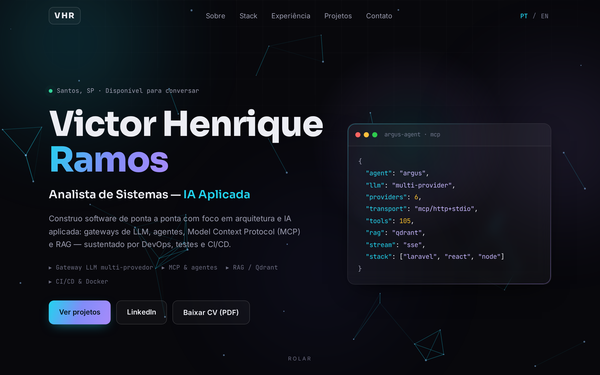

# Victor Henrique Ramos

### Analista de Sistemas · Arquitetura de Software · IA Aplicada (LLM · Agentes · MCP · RAG) · DevOps

&nbsp;

&nbsp;

 

↑ clique para abrir a versão interativa (intro animada, fundo de partículas, parallax, tilt 3D)

---

## 👋 Sobre

Analista de Sistemas full stack com foco em **arquitetura de software** e **IA aplicada**. Na **Autoridade Portuária de Santos (GEDES)**, projetei e desenvolvi uma plataforma corporativa de IA conversacional com agentes — do código à arquitetura: gateway multi-provedor de LLM, sistema de ferramentas via **Model Context Protocol (MCP)**, camada de **RAG** sobre banco vetorial e streaming em tempo real, sustentados por **CI/CD, testes automatizados e análise estática**.

---

## 🧠 Destaques técnicos

| `8` | `105+` | `270+` | `6+` |
|:---:|:---:|:---:|:---:|
| servidores MCP | ferramentas integradas | testes automatizados | provedores de LLM |

---

## 🛠️ Stack

**IA aplicada**

**Backend**

**Frontend**

**Dados · DevOps**

**Qualidade**

---

## 🚀 Projeto em destaque — Argus Agent

Plataforma interna, genérica e extensível, de IA conversacional com agentes configuráveis e ferramentas por domínio _(descrição em nível conceitual)_.

- **Gateway multi-provedor de LLM** com function calling normalizado e streaming (SSE)
- **Sistema de ferramentas via MCP** (8 servidores TypeScript) + bridge HTTP↔STDIO em Node.js
- **Camada de RAG** sobre banco vetorial (Qdrant) e orquestração de agentes com sub-agentes
- **Robustez**: circuit breaker, auto-continuação e permissões em cascata (RBAC)

`Laravel 12` · `React 19` · `Node.js` · `MCP` · `RAG` · `Qdrant` · `PostgreSQL` · `Redis` · `Docker` · `GitLab CI/CD`

---

## 📫 Contato

Santos · São Paulo · Brasil

